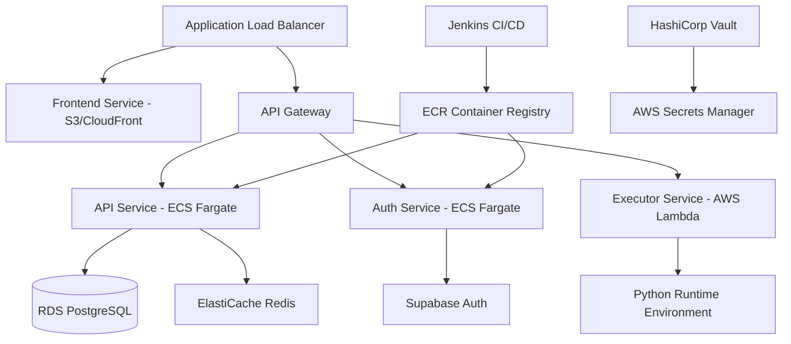

# Python Learning Portal Infrastructure

This repository contains Infrastructure as Code (IaC) for deploying the Python Learning Portal microservices to AWS ECS using Terraform.

## Architecture Overview



## AWS Services Used

### Free Tier Services
- **ECS Fargate**: 20GB-hours vCPU + 40GB-hours memory/month
- **RDS PostgreSQL**: t3.micro (750 hours/month)
- **Application Load Balancer**: 750 hours/month
- **S3**: 5GB storage + 20,000 GET requests
- **CloudFront**: 50GB data transfer
- **Lambda**: 1M requests + 400,000 GB-seconds
- **ECR**: 500MB storage/month

### Paid Services (after free tier)
- **ElastiCache**: Redis for session management
- **Route 53**: DNS management
- **AWS Secrets Manager**: Secret management

## Repository Structure

```
.
├── terraform/
│   ├── environments/
│   │   ├── dev/
│   │   ├── staging/
│   │   └── prod/
│   ├── modules/
│   │   ├── networking/
│   │   ├── ecs-cluster/
│   │   ├── rds/
│   │   ├── redis/
│   │   ├── ecr/
│   │   └── load-balancer/
│   └── variables.tf
├── jenkins/
│   ├── Jenkinsfile
│   └── pipelines/
├── docker/
│   └── docker-compose.local.yml
├── scripts/
│   ├── deploy.sh
│   ├── rollback.sh
│   └── health-check.sh
└── vault/
    └── policies/
```

## Quick Start

### Prerequisites
- AWS CLI configured
- Terraform >= 1.5
- Docker
- Jenkins (optional, for CI/CD)
- HashiCorp Vault (optional, for secrets)

### Deployment Steps

1. **Initialize Terraform**
   ```bash
   cd terraform/environments/dev
   terraform init
   ```

2. **Plan Infrastructure**
   ```bash
   terraform plan
   ```

3. **Deploy to AWS**
   ```bash
   terraform apply
   ```

4. **Deploy Services**
   ```bash
   ./scripts/deploy.sh dev
   ```

## Environment Configuration

### Development
- **Frontend**: S3 static hosting
- **Backend**: 1 ECS task (0.25 vCPU, 0.5GB RAM)
- **Database**: RDS t3.micro
- **Cache**: ElastiCache t3.micro

### Production
- **Frontend**: CloudFront + S3
- **Backend**: Auto-scaling ECS tasks
- **Database**: RDS with read replicas
- **Cache**: ElastiCache cluster mode

## Security

- **VPC**: Private subnets for services
- **Security Groups**: Least privilege access
- **IAM Roles**: Service-specific permissions
- **Secrets Manager**: Environment variables and database credentials
- **WAF**: Web application firewall for ALB

## Monitoring

- **CloudWatch**: Logs and metrics
- **X-Ray**: Distributed tracing
- **Health Checks**: Application-level health endpoints

## Cost Optimization

- **Auto Scaling**: Scale down during low usage
- **Spot Instances**: For non-critical workloads
- **S3 Lifecycle**: Automatic archive of old logs
- **CloudFront**: Edge caching to reduce data transfer costs

## CI/CD Pipeline

1. **Source**: Git push triggers Jenkins
2. **Build**: Docker images built and tested
3. **Test**: Automated testing suite
4. **Deploy**: Blue-green deployment to ECS
5. **Monitor**: Health checks and rollback if needed

## Local Development

Run the entire stack locally:

```bash
docker-compose -f docker/docker-compose.local.yml up
```

This spins up:
- Frontend on http://localhost:3000
- API on http://localhost:3001  
- PostgreSQL on localhost:5432
- Redis on localhost:6379

## Contributing

1. Make changes in feature branches
2. Test locally with Docker Compose
3. Submit PR with infrastructure changes
4. CI/CD will deploy to staging for testing

## Support

For issues or questions:
- GitHub Issues: [python-learning-infrastructure/issues](https://github.com/dstorey87/python-learning-infrastructure/issues)
- Documentation: [Wiki](https://github.com/dstorey87/python-learning-infrastructure/wiki)